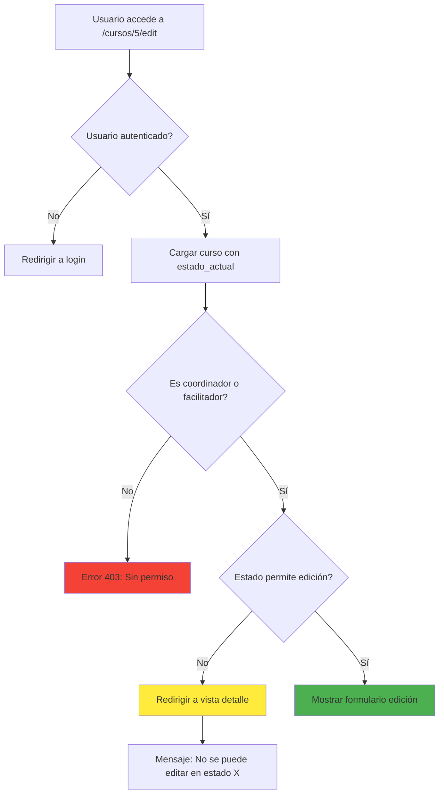

# 🔒 Validación de Estados Editables - EditarCursoController

**Fecha:** 06 de Febrero de 2026  
**Objetivo:** Validar estados editables y redirigir automáticamente a vista de detalle cuando no se puede editar

---

## 🎯 Problema Resuelto

Cuando un usuario intenta editar un curso que no está en un estado editable, ahora se le **redirige automáticamente** a la vista de detalle con un mensaje informativo, en lugar de mostrar un error 403 o permitir la edición incorrectamente.

---

## ✅ Solución Implementada

### **Validación en el Controlador**

**Archivo:** `EditarCursoController.php`  
**Método:** `edit()`

```php
// ✅ VALIDACIÓN DE ESTADOS EDITABLES
// Estados permitidos para edición:
// 1 = Por Aceptar, 3 = Declinado, 4 = En Edición, 7 = En Progreso (solo coordinador)
$estadoActual = $curso->estado_actual->id_estado ?? null;

$estadosEditablesFacilitador = [3, 4]; // Declinado, En Edición
$estadosEditablesCoordinador = [3, 4, 7]; // Declinado, En Edición, En Progreso

$estadosPermitidos = $isCoordinator ? $estadosEditablesCoordinador : $estadosEditablesFacilitador;

// Si el estado no permite edición, redirigir a vista de detalle con mensaje
if (!in_array($estadoActual, $estadosPermitidos)) {
    $nombreEstado = $this->obtenerNombreEstado($estadoActual);
    
    Log::warning('Intento de edición en estado no permitido', [
        'curso_id' => $id,
        'estado_actual' => $estadoActual,
        'estados_permitidos' => $estadosPermitidos,
        'es_coordinador' => $isCoordinator
    ]);
    
    return redirect()
        ->route('taller.cursos.show', $curso->id_curso)
        ->with('warning', "No se puede editar el curso en estado '$nombreEstado'. Solo se puede editar cuando está Declinado o En Edición.");
}
```

---

## 📋 Estados del Curso y Permisos de Edición

### **Tabla de Estados**

| ID | Estado | Facilitador | Coordinador | Descripción |
|----|--------|-------------|-------------|-------------|
| 1 | Por Aceptar | ❌ No | ❌ No | Curso recién creado |
| 2 | Aceptado | ❌ No | ❌ No | Facilitador aceptó curso |
| 3 | Declinado | ✅ **Sí** | ✅ **Sí** | Curso rechazado, puede editar y reenviar |
| 4 | En Edición | ✅ **Sí** | ✅ **Sí** | Facilitador está editando |
| 5 | En Aprobación | ❌ No | ❌ No | Esperando aprobación coordinador |
| 6 | Inscripciones | ❌ No | ❌ No | Período de inscripciones activo |
| 7 | En Progreso | ❌ No | ✅ **Sí** | Curso activo (solo coord. contingencia) |
| 8 | Finalizado | ❌ No | ❌ No | Curso terminado |
| 9 | Cerrado | ❌ No | ❌ No | Curso cerrado definitivamente |

### **Lógica de Permisos**

```php
// Facilitador puede editar en:
$estadosEditablesFacilitador = [3, 4];
// - Estado 3 (Declinado): Para corregir y reenviar
// - Estado 4 (En Edición): Durante proceso de creación

// Coordinador puede editar en:
$estadosEditablesCoordinador = [3, 4, 7];
// - Estado 3 (Declinado): Para revisar
// - Estado 4 (En Edición): Para supervisar
// - Estado 7 (En Progreso): Edición de contingencia
```

---

## 🔄 Flujo de Validación



---

## 🎨 Experiencia del Usuario

### **Escenario 1: Estado No Editable**
```
Usuario intenta editar curso en estado "En Aprobación"
        ↓
Sistema detecta estado no permitido
        ↓
Redirige a /cursos/5 (vista detalle)
        ↓
Muestra mensaje: ⚠️ "No se puede editar el curso en estado 'En Aprobación'. 
                     Solo se puede editar cuando está Declinado o En Edición."
```

### **Escenario 2: Estado Editable**
```
Usuario intenta editar curso en estado "En Edición"
        ↓
Sistema valida permisos OK
        ↓
Muestra formulario de edición
        ↓
Usuario puede modificar curso
```

---

## 💬 Mensajes al Usuario

El sistema usa la sesión flash `with('warning', ...)` para mostrar mensajes amigables:

### Ejemplo en la Vista de Detalle
```blade
@if(session('warning'))
    <div class="alert alert-warning alert-dismissible fade show" role="alert">
        <i class="fas fa-exclamation-triangle me-2"></i>
        {{ session('warning') }}
        <button type="button" class="btn-close" data-bs-dismiss="alert"></button>
    </div>
@endif
```

### Mensajes Generados
- **Estado 1 - Por Aceptar:**  
  "No se puede editar el curso en estado 'Por Aceptar'. Solo se puede editar cuando está Declinado o En Edición."

- **Estado 5 - En Aprobación:**  
  "No se puede editar el curso en estado 'En Aprobación'. Solo se puede editar cuando está Declinado o En Edición."

- **Estado 6 - Inscripciones:**  
  "No se puede editar el curso en estado 'Inscripciones'. Solo se puede editar cuando está Declinado o En Edición."

---

## 🔧 Método Auxiliar: `obtenerNombreEstado()`

```php
/**
 * Obtiene el nombre legible del estado
 *
 * @param int|null $idEstado ID del estado
 * @return string Nombre del estado
 */
private function obtenerNombreEstado(?int $idEstado): string
{
    $estados = [
        1 => 'Por Aceptar',
        2 => 'Aceptado',
        3 => 'Declinado',
        4 => 'En Edición',
        5 => 'En Aprobación',
        6 => 'Inscripciones',
        7 => 'En Progreso',
        8 => 'Finalizado',
        9 => 'Cerrado'
    ];

    return $estados[$idEstado] ?? 'Desconocido';
}
```

**Beneficios:**
- ✅ Centraliza nombres de estados
- ✅ Fácil de mantener
- ✅ Reutilizable en otros métodos
- ✅ Mensajes consistentes

---

## 📊 Comparativa: Antes vs Después

### **Antes (❌ Problema)**

```php
public function edit($id)
{
    $curso = Curso::findOrFail($id);
    
    // ❌ SIN VALIDACIÓN DE ESTADO
    // Permite editar en cualquier estado
    
    return view('taller::a.CursoEditar', compact('curso'));
}
```

**Problemas:**
- ❌ Se puede editar curso en estados incorrectos
- ❌ Datos inconsistentes
- ❌ Errores en actualización
- ❌ Mala experiencia del usuario

### **Después (✅ Solución)**

```php
public function edit($id)
{
    $curso = Curso::with('estado_actual')->findOrFail($id);
    
    // ... verificaciones de permisos ...
    
    // ✅ VALIDACIÓN DE ESTADO
    if (!in_array($estadoActual, $estadosPermitidos)) {
        return redirect()
            ->route('taller.cursos.show', $curso->id_curso)
            ->with('warning', "...");
    }
    
    return view('taller::a.CursoEditar', compact('curso'));
}
```

**Beneficios:**
- ✅ Solo edita en estados válidos
- ✅ Redirección automática amigable
- ✅ Mensajes informativos claros
- ✅ Logs de auditoría

---

## 🧪 Testing

### **Test Unitario**

```php
class EditarCursoControllerTest extends TestCase
{
    /** @test */
    public function no_permite_editar_curso_en_aprobacion()
    {
        $curso = Curso::factory()->create();
        $curso->estado_actual()->attach(5); // En Aprobación
        
        $facilitador = User::factory()->create();
        
        $response = $this->actingAs($facilitador)
            ->get(route('taller.cursos.edit', $curso->id_curso));
        
        $response->assertRedirect(route('taller.cursos.show', $curso->id_curso));
        $response->assertSessionHas('warning');
    }
    
    /** @test */
    public function permite_editar_curso_declinado()
    {
        $curso = Curso::factory()->create();
        $curso->estado_actual()->attach(3); // Declinado
        
        $facilitador = User::factory()->create();
        
        $response = $this->actingAs($facilitador)
            ->get(route('taller.cursos.edit', $curso->id_curso));
        
        $response->assertStatus(200);
        $response->assertViewIs('taller::a.CursoEditar');
    }
}
```

---

## 🚀 Recomendaciones de Uso

### **1. Deshabilitar Botón de Edición en la Vista**

En `CursoDetalle.blade.php`, solo mostrar botón de editar si el estado lo permite:

```blade
@if(in_array($curso->estado_actual->id_estado, [3, 4]) && $esFacilitador)
    <a href="{{ route('taller.cursos.edit', $curso->id_curso) }}" 
       class="btn btn-primary">
        <i class="fas fa-edit me-2"></i> Editar Curso
    </a>
@endif
```

### **2. Middleware de Estados**

Para mayor seguridad, puedes crear un middleware:

```php
class ValidarEstadoCurso
{
    public function handle($request, Closure $next, ...$estadosPermitidos)
    {
        $curso = $request->route('curso');
        
        if (!in_array($curso->estado_actual->id_estado, $estadosPermitidos)) {
            return redirect()
                ->route('taller.cursos.show', $curso->id_curso)
                ->with('warning', 'Estado no permite esta acción.');
        }
        
        return $next($request);
    }
}
```

Uso en rutas:
```php
Route::get('cursos/{curso}/edit', [EditarCursoController::class, 'edit'])
    ->middleware('estado.curso:3,4');
```

---

## ✨ Conclusión

La validación de estados editables implementada:

✅ **Protege integridad de datos**  
✅ **Mejora experiencia del usuario**  
✅ **Redirección automática amigable**  
✅ **Mensajes informativos claros**  
✅ **Auditoría con logs**  
✅ **Diferenciación por roles**

**Flujo completo:**
```
Intento Edición → Validación Estado → ¿Permitido? 
                                          ↓
                                    Sí → Formulario
                                    No → Detalle + Mensaje
```

---

**Autor:** Sistema de Validación de Estados  
**Fecha:** 2026-02-06  
**Versión:** 1.0  
**Tipo:** Validación de Estados + UX
